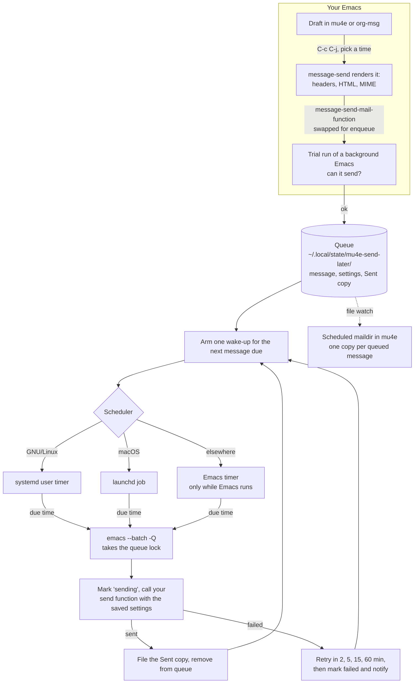

# mu4e-send-later

[](https://github.com/Jotham-LEC/mu4e-send-later/actions/workflows/test.yml)
[](https://github.com/Jotham-LEC/mu4e-send-later/blob/main/LICENSE)

Schedule mail in mu4e. Write a message, press `C-c C-j`, pick a time, and
close Emacs if you like: when the time comes, a systemd user timer (GNU/Linux)
or a launchd job (macOS) starts a background Emacs that sends it. Works with
plain `message-mode` and with [org-msg](https://github.com/jeremy-compostella/org-msg).


It fails loudly: a message is only reported as scheduled once its timer
exists, a failed send is retried and then kept, never dropped, and a send
cut short is never repeated on its own.

## Dependencies

> [!IMPORTANT]
> You need **Emacs 29.1+**, **mu4e that already sends mail**, and either
> **systemd** (GNU/Linux) or **launchd** (macOS). No other Emacs packages are
> installed; Org and smtpmail come with Emacs.

**Required**

| Dependency | Why | Notes |
| ---------- | --- | ----- |
| Emacs 29.1 or later | runs everything | tested on 29.1, 30.1 and 31.1 |
| [mu / mu4e](https://www.djcbsoftware.nl/code/mu/) | where you write and see scheduled mail | not on any package archive; installed with `mu`. Tested with mu 1.14 |
| A working way to send mail | the background Emacs sends with *your* setup | `smtpmail` (Doom's default, built in), or a sendmail program such as [msmtp](https://marlam.de/msmtp/) |
| A scheduler | starts the background Emacs at the due time | GNU/Linux: a **systemd user manager** (`systemd-run`, `systemctl --user`). macOS: **launchd** (`launchctl`). Without either, mail goes out only while Emacs runs |
| Org (built in) | the date prompt (`+2h`, `mon 9:00`) | |

**Optional**

| Dependency | What it adds |
| ---------- | ------------ |
| [org-msg](https://github.com/jeremy-compostella/org-msg) | schedule HTML mail written in Org |
| A desktop notification daemon (D-Bus) | pop-ups for failed sends; on macOS, `osascript`, built in. Everything is also logged |
| gpg-agent with a cached passphrase or a graphical pinentry | needed if your SMTP password is in `~/.authinfo.gpg` (Doom's default `auth-sources`) |
| `sh` | lets a send started by the Emacs-timer fallback outlive Emacs |

**Platforms:**
- **GNU/Linux with systemd and macOS:** fully supported, and tested in CI.
- **WSL2:** works like GNU/Linux if systemd is enabled.
- **Native Windows:** not supported.
- **Anywhere else:** mail is sent only while Emacs is running.

mu4e-send-later uses a few of mu4e's internal functions (`mu4e--server-add`,
`-remove`, `-move` and `mu4e--draft`). If a mu4e release renames them, mail
is still scheduled and sent. mu4e then sees changes only at its next index,
and replied-to messages are not marked.

## Install

Doom Emacs. In `packages.el`:

```elisp
(package! mu4e-send-later
  :recipe (:host github :repo "Jotham-LEC/mu4e-send-later"))
```

and in `config.el`:

```elisp
(use-package! mu4e-send-later
  :after mu4e
  :config (mu4e-send-later-mode 1))
```

Then run `doom sync`.

Plain Emacs (29 or later):

```elisp
(use-package mu4e-send-later
  :vc (:url "https://github.com/Jotham-LEC/mu4e-send-later" :rev :newest)
  :after mu4e
  :config (mu4e-send-later-mode 1))
```

On Emacs 29, which has no `:vc` keyword, run
`(package-vc-install "https://github.com/Jotham-LEC/mu4e-send-later")` once
and drop the `:vc` line.

That is all the setup there is. Your mu4e settings are used as they are,
including the context you are composing in. The mode:

- binds `C-c C-j` in mu4e. In a draft it schedules the message (Gnus uses the
  same key for this); in the message list and the message view it opens the
  queue;
- adds a **Scheduled** bookmark, on `s`;
- whenever it starts, sends mail that fell due while the computer was off.

## Use

| Where                       | Key / command                     | Does                                     |
| --------------------------- | --------------------------------- | ---------------------------------------- |
| a draft                     | `C-c C-j` (`mu4e-send-later`)     | ask when to send (`+2h`, `16:30`, `mon 9:00`), confirm, queue |
| mu4e                        | `C-c C-j` (`mu4e-send-later-list`) | show the queue                           |
| the queue                   | `e` / `r` / `s` / `c`             | edit / reschedule / send now / cancel    |
| a message in Scheduled      | `M-x mu4e-send-later-edit` etc.   | the same, on that message                |

The time is read by Org's date prompt. It always shows the date it understood
and asks you to confirm it, because Org reads `+30m` as thirty *months*.

Doom users on evil who prefer the localleader:

```elisp
(map! :after mu4e :map mu4e-compose-mode-map :localleader "l" #'mu4e-send-later)
(map! :after org-msg :map org-msg-edit-mode-map :localleader "l" #'mu4e-send-later)
```

## Options

| Option                          | Default            | Meaning                                                     |
| ------------------------------- | ------------------ | ----------------------------------------------------------- |
| `mu4e-send-later-key`           | `"C-c C-j"`        | key the mode binds; `nil` binds none                        |
| `mu4e-send-later-bookmark`      | `t`                | add the Scheduled bookmark                                  |
| `mu4e-send-later-maildir`       | `"/scheduled"`     | where mu4e shows scheduled mail; **keep it out of your mail sync** |
| `mu4e-send-later-retry-delays`  | 2, 5, 15, 60 min   | waits between retries of a failed send                     |
| `mu4e-send-later-variables`     | the `smtpmail-*` and sendmail settings, `user-mail-address`, `auth-sources`, … | settings copied into the background sender; add any your send function reads |
| `mu4e-send-later-backend`       | `auto`             | `systemd`, `launchd` or `emacs` (only while Emacs runs)     |
| `mu4e-send-later-emacs-program` | the running Emacs  | set this on Nix, where that path can be garbage-collected   |
| `mu4e-send-later-directory`     | `~/.local/state/mu4e-send-later/` | the queue                                       |

## How it works



Your Emacs only queues the message. A separate background Emacs, started by
the operating system, sends it, so your Emacs need not be running then. See
[How It Works](https://github.com/Jotham-LEC/mu4e-send-later/wiki/How-It-Works)
for details.

## If something goes wrong

- **The SMTP password is in `~/.authinfo.gpg`** (Doom's default
  `auth-sources`): the background Emacs needs gpg-agent to decrypt it, so the
  passphrase must be cached, or a graphical pinentry must be able to ask for
  it. Otherwise the send fails and is retried. msmtp with `passwordeval` and a
  keyring has no such problem.
- **`sendmail-query-once`**: if you have never told Emacs how to send mail,
  scheduling is refused. Doom sets this for you.
- **Failed messages** show in `M-x mu4e-send-later-list` with the error, and
  you are warned each time Emacs starts. Everything is logged to
  `~/.local/state/mu4e-send-later/log`.

More in the [wiki](https://github.com/Jotham-LEC/mu4e-send-later/wiki):
[How it works](https://github.com/Jotham-LEC/mu4e-send-later/wiki/How-It-Works),
[Troubleshooting and limitations](https://github.com/Jotham-LEC/mu4e-send-later/wiki/Troubleshooting),
[Alternatives](https://github.com/Jotham-LEC/mu4e-send-later/wiki/Alternatives).

## Development

`make deps` once, then `make check` (compile, lint, format, tests), or
`make integration` for real systemd timers or launchd jobs on a queue of their
own. See [CONTRIBUTING.md](CONTRIBUTING.md). The images are made by
`images/screenshots.el`, which sends nothing.

## License

GPL-3.0-or-later. See [LICENSE](LICENSE).
