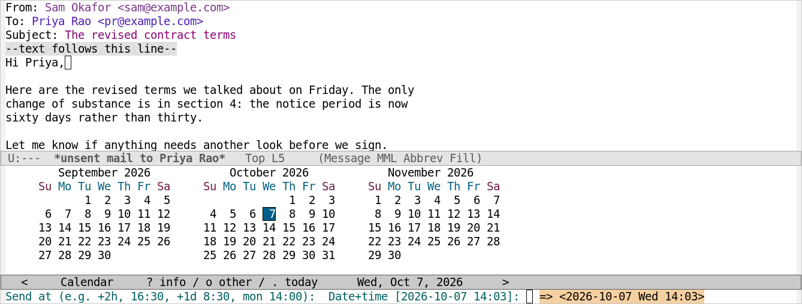
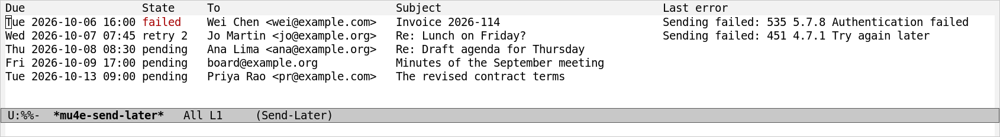

# mu4e-send-later

[](https://github.com/Jotham-LEC/mu4e-send-later/actions/workflows/test.yml)
[](https://github.com/Jotham-LEC/mu4e-send-later/blob/main/LICENSE)

mu4e-send-later sends a message you write in mu4e at a time you choose, and
Emacs need not be running then. You write the message, say when it should go
out, and may close Emacs: at that time a systemd user timer (GNU/Linux) or a
launchd job (macOS) starts a background Emacs that sends it. Mail that fell
due while the computer was asleep goes out when it wakes.

It works whether you write in plain `message-mode` or with
[org-msg](https://github.com/jeremy-compostella/org-msg). Scheduled mail
appears in mu4e, where you can read, edit, reschedule, send or cancel it.



- **Nothing polls.** One timer is set for the next message due, and moved
  whenever the queue changes. An empty queue has no timer at all.
- **It fails loudly.** A message is reported as scheduled only once its
  timer has been created *and* checked. A failed send is retried, then kept
  and reported, never dropped. A send that is cut short is never repeated on
  its own; if a message may have gone out, you are told.

## Installation

mu4e-send-later requires Emacs 29.1 or later. It is written for mu4e, and
works with org-msg if you use it.

It is not on MELPA yet. To install it from its Git repository with
`package-vc` (Emacs 29 or later):

```elisp
(package-vc-install "https://github.com/Jotham-LEC/mu4e-send-later")
```

With `use-package` and `:vc` (Emacs 30 or later):

```elisp
(use-package mu4e-send-later
  :vc (:url "https://github.com/Jotham-LEC/mu4e-send-later" :rev :newest)
  :config (mu4e-send-later-mode 1))
```

With [straight.el](https://github.com/radian-software/straight.el):

```elisp
(straight-use-package
 '(mu4e-send-later :type git :host github :repo "Jotham-LEC/mu4e-send-later"))
```

With Doom Emacs, in `packages.el`:

```elisp
(package! mu4e-send-later
  :recipe (:host github :repo "Jotham-LEC/mu4e-send-later"))
```

## Setting Up

### The Mode

Turn on `mu4e-send-later-mode` in your init file:

```elisp
(mu4e-send-later-mode 1)
```

Each time Emacs starts with the mode on, it sends mail that fell due while
Emacs was not running, re-arms the timer (which a reboot clears), and warns
about messages that failed to send.

### How Mail Is Sent

The background Emacs sends with whatever `message-send-mail-function` was
when you scheduled the message. If that is message.el's default, the
function is worked out as message.el would work it out, from
`send-mail-function`, and that is stored too (see [Mail
Variables](https://www.gnu.org/software/emacs/manual/html_node/message/Mail-Variables.html)
in The Message Manual).

Out of the box, `send-mail-function` is `sendmail-query-once`, which asks you
how to send; in the background there is no one to answer. Set it, to
`smtpmail-send-it` or, for msmtp and similar programs, to `sendmail-send-it`,
or set `message-send-mail-function` (see [Mail
Sending](https://www.gnu.org/software/emacs/manual/html_node/emacs/Mail-Sending.html)
in The GNU Emacs Manual, and [The Emacs SMTP
Library](https://www.gnu.org/software/emacs/manual/html_node/smtpmail/index.html)).
Until you do, scheduling is refused.

### The Scheduled Bookmark

Scheduled mail is kept in a maildir of its own, `mu4e-send-later-maildir`
(`/scheduled` under mu's root). Make sure your mail sync does not upload it;
mbsync syncs only the folders its channels name. Add a bookmark for it (see
[Bookmarks and
Maildirs](https://www.djcbsoftware.nl/code/mu/mu4e/Bookmarks-and-Maildirs.html)
in the mu4e manual):

```elisp
(add-to-list 'mu4e-bookmarks
             '(:name "Scheduled" :query "maildir:/scheduled" :key ?s))
```

### Key Bindings

mu4e-send-later binds no keys. For example, in your init file:

```elisp
(with-eval-after-load 'mu4e
  (define-key mu4e-compose-mode-map (kbd "C-c C-S-s") #'mu4e-send-later)
  (dolist (map (list mu4e-headers-mode-map mu4e-view-mode-map))
    (define-key map (kbd "C-c s e") #'mu4e-send-later-edit)
    (define-key map (kbd "C-c s r") #'mu4e-send-later-reschedule)
    (define-key map (kbd "C-c s s") #'mu4e-send-later-send-now)
    (define-key map (kbd "C-c s c") #'mu4e-send-later-cancel)))
```

org-msg drafts have a mode of their own, derived from `org-mode` rather than
`message-mode`, so bind `mu4e-send-later` there too:

```elisp
(with-eval-after-load 'org-msg
  (define-key org-msg-edit-mode-map (kbd "C-c C-S-s") #'mu4e-send-later))
```

## Scheduling a Message

In a draft, type `M-x mu4e-send-later`. The command reads the time to send
at with Org's date prompt, `org-read-date` (see [The Date/Time
Prompt](https://orgmode.org/manual/The-date_002ftime-prompt.html) in The Org
Manual), which accepts such forms as `+2h`, `16:30`, `+1d 8:30` and
`mon 14:00`. A time that has already passed is refused.

Before anything is queued, the command always shows the date your answer was
read as, and asks you to confirm it: `org-read-date` reads `+30m` as thirty
*months*, and `tomorrow 9am` as today. Once the message is queued, the draft
is put away as after an ordinary send, and the command echoes the time, as
in `Scheduled for Tue 13 Oct 09:00`. With the `emacs` backend it adds
`(only sent while Emacs is running)`.

An org-msg draft is rendered to HTML and plain text when you schedule it,
and org-msg's check for a forgotten attachment runs then too.

## Commands

<dl>
<dt><code>M-x mu4e-send-later</code></dt>
<dd>

In a draft, read a time, confirm it, and queue the message to be sent then.

</dd>
<dt><code>M-x mu4e-send-later-edit</code></dt>
<dd>

Unschedule the message and reopen its draft as you wrote it, org-msg
included. Schedule it again with `mu4e-send-later` when you are done.

</dd>
<dt><code>M-x mu4e-send-later-reschedule</code></dt>
<dd>

Move the message to another time, read as for `mu4e-send-later`.

</dd>
<dt><code>M-x mu4e-send-later-send-now</code></dt>
<dd>

Send the message now, or retry it after it failed.

</dd>
<dt><code>M-x mu4e-send-later-cancel</code></dt>
<dd>

Unschedule the message, after asking, and keep a copy of it in the queue's
`cancelled/` directory.

</dd>
<dt><code>M-x mu4e-send-later-list</code></dt>
<dd>

Show the queue, with each message's state and last error. See [The Queue
List](#the-queue-list).

</dd>
<dt><code>M-x mu4e-send-later-check</code></dt>
<dd>

Send anything overdue, re-arm the timer, and report failed messages.
`mu4e-send-later-mode` does this each time Emacs starts.

</dd>
<dt><code>M-x mu4e-send-later-install-login-job</code></dt>
<dd>

Also send overdue mail at login, without opening Emacs. On GNU/Linux this
installs and enables a systemd user unit; on macOS, a launchd job.

</dd>
<dt><code>M-x mu4e-send-later-uninstall-login-job</code></dt>
<dd>

Remove the job that `mu4e-send-later-install-login-job` installed.

</dd>
</dl>

The four commands `mu4e-send-later-edit`, `-reschedule`, `-send-now` and
`-cancel` act on the scheduled message at point: in the Scheduled bookmark,
either in the message list or in an open message, or in the queue list. In
mu4e, the date shown for a scheduled message is the time it will be sent.

### The Queue List

`M-x mu4e-send-later-list` shows every message in the queue, with when it is
due, its state, its recipients and subject, and the last error, if any.



A message is `pending` until it is sent. Once a send has failed and is to be
retried, its state is `retry` and the number of attempts so far; once the
retries are used up, it is `failed`, and it stays so until you retry or
cancel it. A message whose metadata cannot be read is listed as
`unreadable`.

In the list, these keys act on the message at point:

| Key   | Action                                  |
| ----- | --------------------------------------- |
| `RET` | view the queued message, as raw text    |
| `e`   | `mu4e-send-later-edit`                  |
| `r`   | `mu4e-send-later-reschedule`            |
| `s`   | `mu4e-send-later-send-now`              |
| `c`   | `mu4e-send-later-cancel`                |

## Customization

<dl>
<dt><code>mu4e-send-later-backend</code></dt>
<dd>

What wakes up to send a message once it is due: `systemd`, `launchd`,
`emacs`, or `auto` (the default), which picks the first of these that works.
See [Backends](#backends).

</dd>
<dt><code>mu4e-send-later-maildir</code></dt>
<dd>

The maildir, relative to mu's root, in which mu4e shows scheduled mail. The
default is `/scheduled`. Make sure your mail sync does not upload it.

</dd>
<dt><code>mu4e-send-later-retry-delays</code></dt>
<dd>

Seconds to wait before each retry of a failed send. The default,
`(120 300 900 3600)`, retries after 2, 5, 15 and 60 minutes. Once these are
used up, the message is marked failed.

</dd>
<dt><code>mu4e-send-later-variables</code></dt>
<dd>

Variables whose values when you schedule are used when the message is sent.
The background Emacs does not load your init file, so anything your
`message-send-mail-function` reads must be listed here. The default list
covers `user-mail-address`, `user-full-name`, `mail-host-address`,
`sendmail-program` and the options for the sendmail envelope and arguments,
the `smtpmail-*` options, `auth-sources` and `send-mail-function`. To add
one:

```elisp
(add-to-list 'mu4e-send-later-variables 'smtpmail-debug-info)
```

</dd>
<dt><code>mu4e-send-later-emacs-program</code></dt>
<dd>

The Emacs executable that sends queued mail in the background. The default,
`nil`, means the Emacs that is running when you schedule. Set this if that
path can disappear, as it can on Nix (see [Limitations](#limitations)).

</dd>
<dt><code>mu4e-send-later-directory</code></dt>
<dd>

The directory that holds the queue. The default is `mu4e-send-later/` under
`$XDG_STATE_HOME`, or under `~/.local/state` if that is not set.

</dd>
</dl>

## How It Works

### Queuing

Every `message-mode` client sends through one pluggable step,
`message-send-mail-function`, which receives the finished message: its
headers generated, org-msg's HTML rendered, MIME-encoded.
`mu4e-send-later` does a normal send with that step replaced by "store in
the queue". It also stores your send function and the settings it reads,
such as `sendmail-program` and the `smtpmail-*` options (see
`mu4e-send-later-variables`).

### Sending

At the due time, the scheduler starts `emacs --batch -Q` with this package
loaded. It restamps the `Date:` header and calls the stored send function
with the stored settings. Your init file is not loaded, so the result does
not depend on the state of your interactive session.

### The Sent Copy

The copy for your Sent folder (`Fcc:`) waits too. It is made when you
schedule, as message.el would make it, and kept with the message. Once the
message has gone out, the background Emacs files the copy, dated when the
message was sent: in the maildir mu4e chose, or appended to the mbox
message.el would append it to. A message that is cancelled, or never sent,
leaves nothing in Sent.

In mu4e, the message you replied to is then marked replied (or passed, for a
forward), once mu4e is running in your Emacs; mu4e is told about the new
copy at the same time.

### Backends

| Backend   | Where                                 | Sends while Emacs is closed | After a reboot                                    |
| --------- | ------------------------------------- | --------------------------- | ------------------------------------------------- |
| `systemd` | GNU/Linux with a systemd user manager | yes                         | when Emacs starts, or at login with the login job |
| `launchd` | macOS                                 | yes                         | when Emacs starts, or at login with the login job |
| `emacs`   | anywhere else                         | no                          | when Emacs starts                                 |

`mu4e-send-later-backend` defaults to `auto`, which picks the first of these
that works. Whether you use X11 or Wayland makes no difference.

### Scheduled Mail in mu4e

For mu4e, each queued message is also copied into `mu4e-send-later-maildir`,
dated when it is due, and added to mu's index. The copy is removed once the
message is sent, edited or cancelled. Only your interactive Emacs touches
that maildir. It catches up when mu4e starts, after each change you make,
and, since it watches the queue, when the background sender sends
something.

## When Things Go Wrong

### Errors When Scheduling

Each of the following is an error when you schedule, and the draft stays
open:

- There is no usable scheduler, or the timer was not there after it was
  created.
- The Emacs executable the timer would run does not exist.
- A trial run of the background Emacs cannot find your send function or
  `sendmail-program`. With systemd the trial runs as a user service, in the
  scheduler's own environment. With launchd it runs from Emacs, in Emacs's
  environment; the jobs themselves get Emacs's `PATH`, but none of its other
  variables.
- The send function would ask how to send (`sendmail-query-once`; see [How
  Mail Is Sent](#how-mail-is-sent)).
- The draft has an `X-Message-SMTP-Method` header, which makes message.el
  send it at once through the method it names. That is not supported yet;
  remove the header to schedule the message. For the same reason,
  `message-server-alist` is ignored while scheduling.
- A setting that would be needed cannot be stored.

If a background send is under way, scheduling, rescheduling and cancelling
wait up to 5 seconds for it, then say `A send is in progress` so that you
can try again. A queued message that cannot be read is left in the queue and
reported, and the others are sent as usual.

### Failed Sends

When a send fails, the failure is recorded on the message, and the send is
retried after 2, 5, 15 and 60 minutes (`mu4e-send-later-retry-delays`), with
a desktop notification on the first failure. After the last retry, the
message is marked failed, you get an urgent notification, and it stays in
the queue until you retry or cancel it.

Each time Emacs starts, `mu4e-send-later-mode` warns about failed messages.
This also catches the case of a timer that never fired at all.

A sendmail that exits with status 0 but prints something (a warning from
msmtp, for example) has taken the message, so the message counts as sent,
and what the program printed is shown in a notification.

### Interrupted Sends

A send that is cut short is never repeated on its own. A message is marked
`sending` just before it is handed to your send function. If the sender dies
at that moment (in a crash or a power cut), there is no way to know whether
the mail server already took the message, so it is never sent again on its
own. The next run marks it failed with "may have been sent, please check",
and gives an urgent notification. The package tells you, rather than risk
sending the message twice.

Your Sent folder cannot settle the question, since the copy is filed only
once the send has finished. Ask the recipient, or look in what your mail
provider keeps of sent mail, if it keeps any (Gmail does). Then use
`mu4e-send-later-send-now` or `mu4e-send-later-cancel` on the message.

If a message was sent but its copy could not be filed (because the Sent
maildir or mbox cannot be written, for example), it is not sent again. The
copy is kept in the queue's `unfiled/` directory, and an urgent notification
says where.

Delivery is therefore at most once as far as this package can know, not
absolutely. A send that fails is retried, and your send function knows only
what the server told it: if the server took the message but the connection
dropped before it said so, the send looks failed, and the retry delivers the
message a second time.

### Errors and Logs

Errors are signalled as `mu4e-send-later-backend-error` or
`mu4e-send-later-send-error`, both children of `mu4e-send-later-error`.

Everything is logged to the file `log` in the queue directory, by default
`~/.local/state/mu4e-send-later/log`. Once it reaches 1 MB it is moved to
`log.old`, replacing the previous one. The same is done with `launchd.log`,
where launchd writes what the background Emacs prints on macOS.

Cancelled and edited messages stay in the queue's `cancelled/` directory,
and copies that could not be filed in `unfiled/`, until you delete them;
nothing prunes those directories.

## Limitations

- A crash at the wrong moment leaves a message you must check by hand, not
  one sent twice. A send that fails after the server has taken the message,
  however, is retried, and arrives twice (see [Interrupted
  Sends](#interrupted-sends)).
- The Sent copy waits until the message is sent only when it goes where mu4e,
  or message.el's default, would put it (see [The Sent
  Copy](#the-sent-copy)). An `Fcc:` that pipes to a program, one to an mbox
  that does not exist yet (message.el asks before creating it), and one
  handled by a `message-fcc-handler-function` of your own are still done when
  you schedule, as is deleting the draft.
- The copy in the Scheduled maildir is only a view. Deleting or moving it in
  mu4e does not cancel the send, and it comes back on the next sync; use
  `mu4e-send-later-cancel` on it instead. Flagging it or marking it read is
  harmless.
- mu4e shows each change at once, but a newly scheduled message appears in a
  Scheduled list that is already open only once you refresh it (`g`).
- Messages scheduled before the draft was kept with them (before 2026-09-28)
  cannot be edited, only cancelled and written again.
- mu4e is updated through its internal functions `mu4e--server-add`,
  `mu4e--server-remove` and `mu4e--server-move`, as of mu 1.14. If a version
  of mu4e renames them, the Scheduled maildir and the Sent copies are still
  written, and mu sees them when it next indexes, but no message is marked
  replied; and `mu4e-send-later-edit` opens the draft in a buffer of its own,
  rather than as mu4e opens a draft.
- The background Emacs has no access to secrets unlocked in your session.
  Most sendmail setups work, including msmtp with `passwordeval`. smtpmail
  with `~/.authinfo.gpg` needs gpg-agent to have the passphrase cached
  already. Nothing can answer a prompt there either: a send that asks for a
  password fails and is retried, rather than waiting.
- A send already under way in the background carries on if you quit Emacs.
- Upgrades: pending timers and the login job name the Emacs executable and
  the directory this package was loaded from, and an upgrade can move either.
  The timers are re-armed when the new version is loaded with the mode on, as
  package.el loads it when it upgrades, and by the check made each time Emacs
  starts. That check also warns if the login job points somewhere stale; run
  `mu4e-send-later-install-login-job` again then. On Nix, the running Emacs's
  store path can be garbage-collected after an upgrade, so set
  `mu4e-send-later-emacs-program` to a path that survives it.
- Since version 0.3.0, timers are named after the queue directory. systemd
  timers armed by version 0.2 keep their old names; they fire once, send
  whatever is due, and go away. On macOS, version 0.2's
  `com.github.jotham-lec.mu4e-send-later.<number>.plist` files in
  `~/Library/LaunchAgents` are no longer cleaned up; delete them by hand.
- The launchd backend is tested end to end in CI, on GitHub's macOS runners,
  but not yet on a Mac in daily use; reports are welcome. launchd has minute
  resolution, so on macOS mail goes out up to a minute late.
- launchd's calendar is the Mac's local time. If the Mac's time zone moves
  west after you schedule, as when you fly from London to New York, mail goes
  out late by the difference, unless Emacs starts in the meantime or you run
  `M-x mu4e-send-later-check`, either of which re-arms the job. A move east
  is harmless.

## Alternatives

These were considered before this package was written, and do not meet the
same need:

- **gnus-delay**, part of Gnus. Delayed messages wait in a Gnus group and go
  out when Gnus next checks for news, so Gnus has to be running. It is worth
  a look if you read mail in Gnus.
- **mu4e-send-delay** and **mu4e-delay**. These keep the message as a draft,
  with a header saying when to send it, and a timer in Emacs sends it, so
  Emacs has to be running at that time.
- **Scheduled send on the server.** Gmail, Fastmail and Outlook all offer it
  in their web apps. It needs no computer of yours at all, but it cannot be
  reached over SMTP, so mu4e cannot use it.
- **msmtpq**, msmtp's queue. It holds mail while you are offline and sends
  it when you are back, which is a different problem: there is no send time.

## Development

```sh
make deps      # install org-msg, package-lint and relint into .deps/
make check     # all of the below but integration; what CI runs
make compile   # byte-compile the package and its tests, warnings are errors
make lint      # checkdoc, package-lint and relint; fails on any warning
make format    # indent as plain emacs -Q does (format-check only reports)
make test      # unit tests, against a fake scheduler and a fake send function
make integration   # real systemd timers or launchd jobs, on a queue of its own, and a fake sendmail
```

[CONTRIBUTING.md](CONTRIBUTING.md) describes what a change needs. The images
in this file are made by `images/screenshots.el`, which schedules nothing
and sends nothing: its queue is a temporary directory, and the scheduler and
every way of sending mail are stubbed out.

## License

mu4e-send-later is free software, released under the GNU General Public
License, version 3 or later. See [LICENSE](LICENSE).
